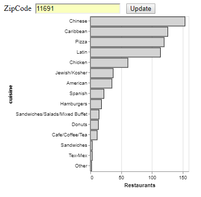
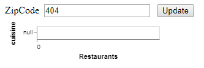

# end-to-end-Data-Visualization
A project to create an end-to-end data visualization platform. Hosted on http://rs5788.pythonanywhere.com

This visualization shows the number of restaurants per cuisine for the entered zip code in NYC.

Figure 1: When a valid zip(11691) is entered

Figure 2: When an invalid zip(404) is entered

